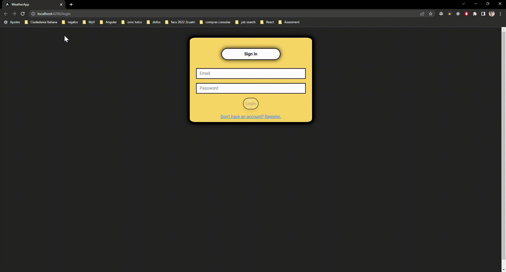
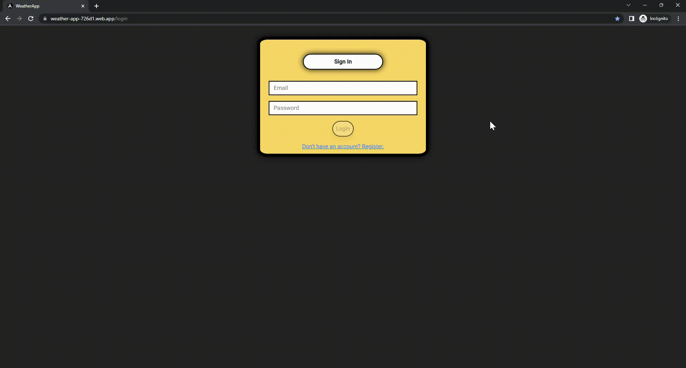
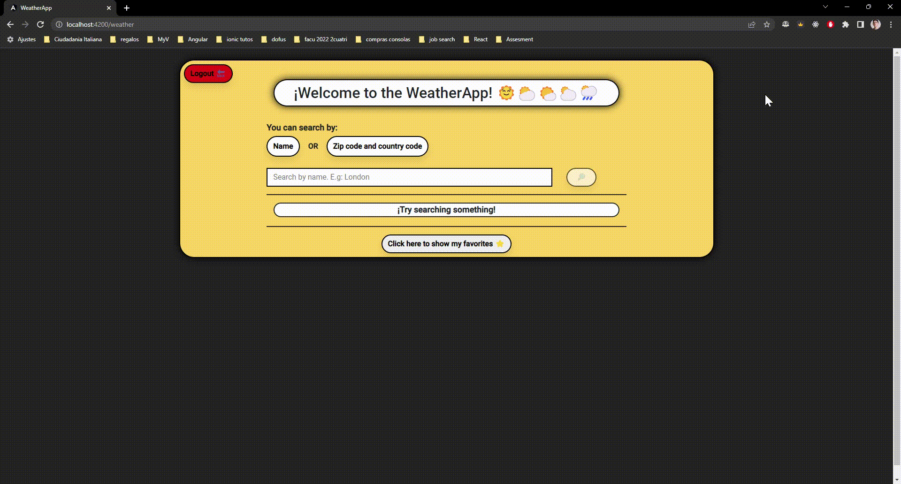
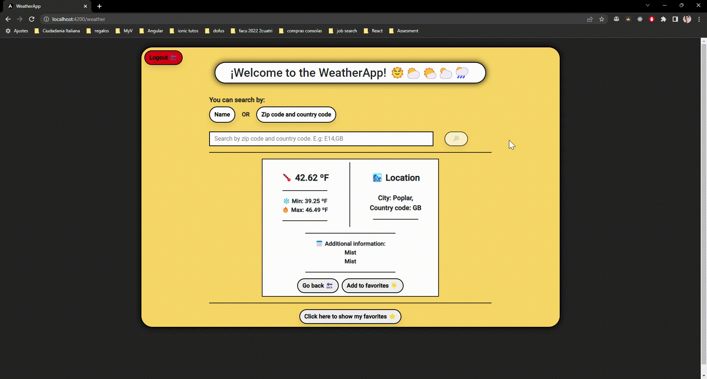

# ¡Welcome to the WeatherApp!
Developed By Martín Herrera

## **Stack:**
#### Front-end:
- Angular 15
- Bootstrap
- Angular Material
- CSS

#### Back-end:
- Firebase
- Open Weather Map API

#### Deployed in:
https://weather-app-726d1.web.app/login

## **Tutorials:**
Github reduces the gif's quality so I uploaded the demo videos to the following drive: 
https://drive.google.com/drive/folders/1daRkOAo-hpthtIcpol5Ikj3-f4i6ljN_?usp=sharing

#### 1 - Create an account

      

#### 2 - Login

      

#### 3 - Search a location by name or zip-code and country code

      

#### 4 - Add to favorites 

      

#### 5 - Delete from favorites and search again from favorites 

      

#### 6 - Create and delete an alert 

      

