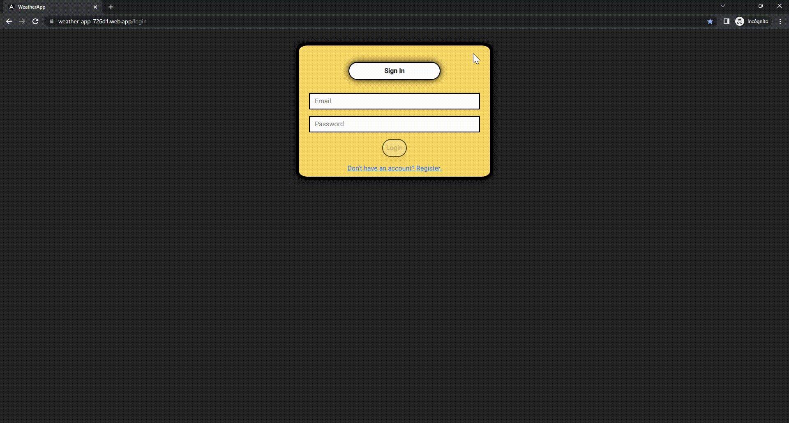
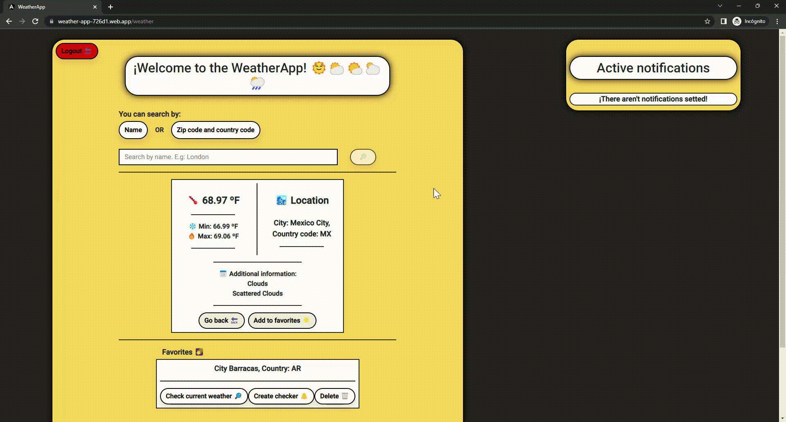

# ¡Welcome to the WeatherApp!

Developed By Martín Herrera

## **Stack:**

#### Front-end:

- Angular 15
- Bootstrap
- Angular Material
- CSS

#### Back-end:

- Firebase
- Open Weather Map API

#### Deployed in:

https://weather-app-726d1.web.app/login

## **Tutorials:**

Github reduces the gif's quality so I uploaded the demo videos to the following drive:
https://drive.google.com/drive/folders/1daRkOAo-hpthtIcpol5Ikj3-f4i6ljN_?usp=sharing

#### 1 - Create an account

      

#### 2 - Login

      

#### 3 - Search a location by name or zip-code and country code

      

#### 4 - Add, delete and interact with the favorites

      

#### 5 - Search again and go back to select a previous searched location

      

#### 6 - Create and delete an alert

      

